# E-Commerce Flutter Application

> Aplikasi E-Commerce mobile menggunakan Flutter dan Supabase  
> Memenuhi Ujian Akhir pada mata kuliah Pemrograman II (dua)

##  Tentang Aplikasi

Aplikasi e-commerce modern yang dibangun dengan Flutter untuk platform mobile (Android & iOS) dan web. Aplikasi ini menyediakan fitur lengkap untuk berbelanja online dengan antarmuka yang responsif dan user-friendly.

##  Tech Stack

-  **Framework**: Flutter 3.35.6
-  **Backend**: Supabase (PostgreSQL)
-  **State Management**: GetX
-  **Local Storage**: GetStorage
-  **UI Components**: Material Design 3
-  **Animations**: Lottie
-  **Fonts**: Google Fonts (Poppins)
-  **Environment**: flutter_dotenv

##  Class Diagram

##  Screenshots

### Authentication
<table>
  <tr>
    <td>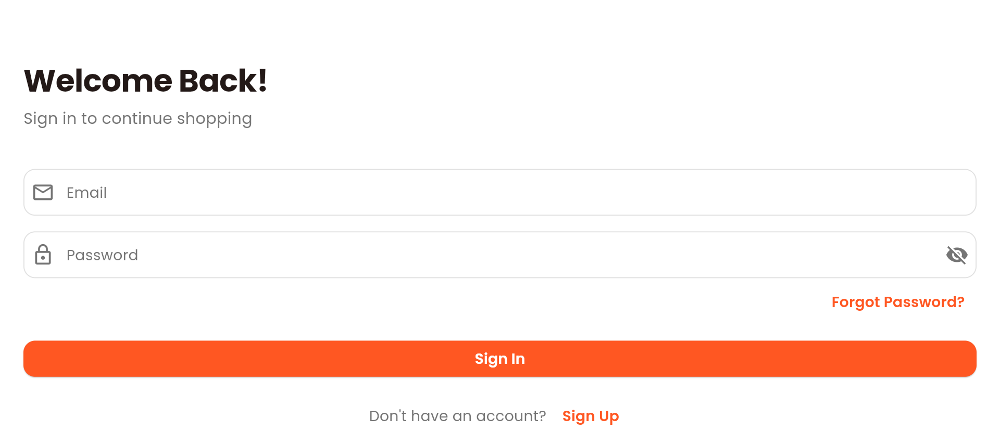</td>
    <td>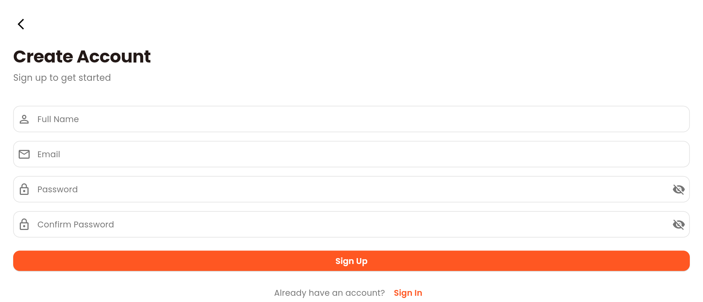</td>
    <td>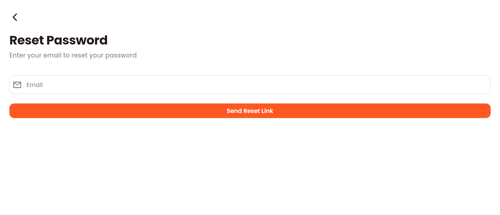</td>
    <td>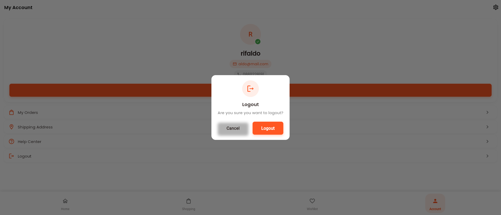</td>
  </tr>
  <tr>
    <td align="center"><b>Sign In</b></td>
    <td align="center"><b>Sign Up</b></td>
    <td align="center"><b>Reset Password</b></td>
    <td align="center"><b>Logout</b></td>
  </tr>
</table>

### Home Screen
<table>
  <tr>
    <td>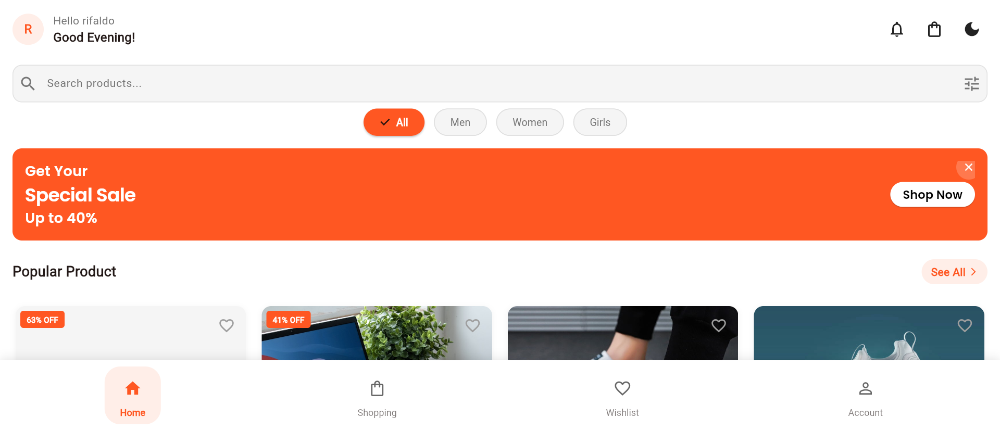</td>
    <td>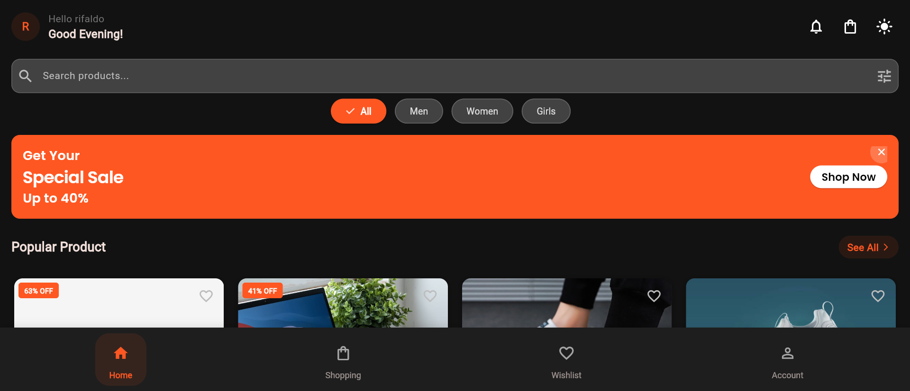</td>
  </tr>
  <tr>
    <td align="center"><b>Light Mode</b></td>
    <td align="center"><b>Dark Mode</b></td>
  </tr>
</table>

### User Profile
<table>
  <tr>
    <td>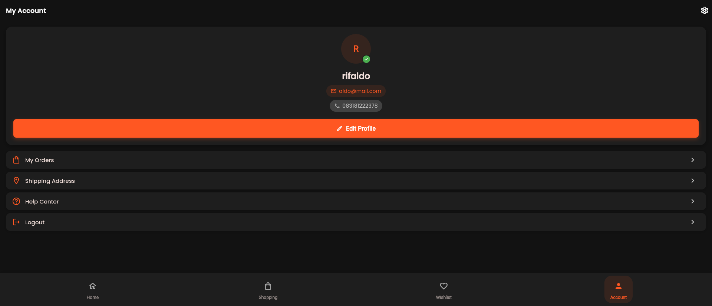</td>
    <td>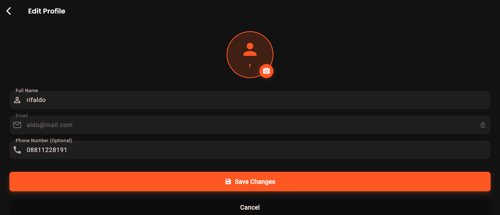</td>
    <td>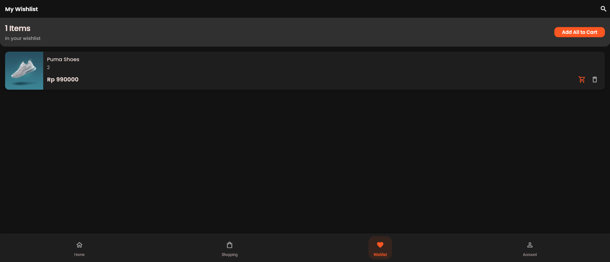</td>
    <td>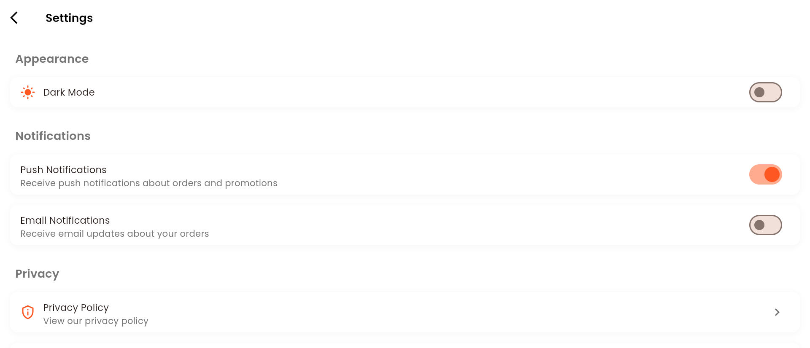</td>
  </tr>
  <tr>
    <td align="center"><b>Profile</b></td>
    <td align="center"><b>Edit Profile</b></td>
    <td align="center"><b>Wishlist</b></td>
    <td align="center"><b>Settings</b></td>
  </tr>
</table>

### Orders & Details
<table>
  <tr>
    <td>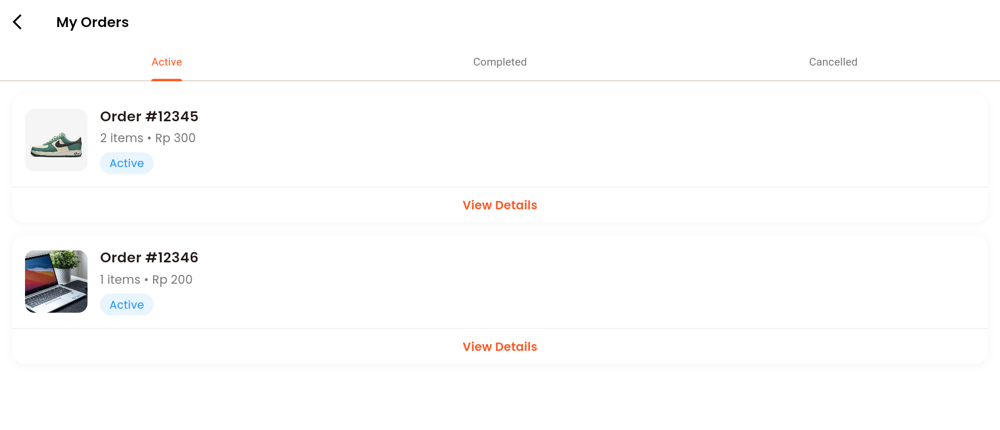</td>
    <td>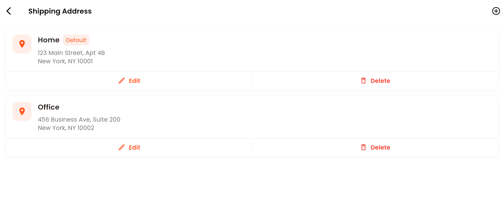</td>
    <td>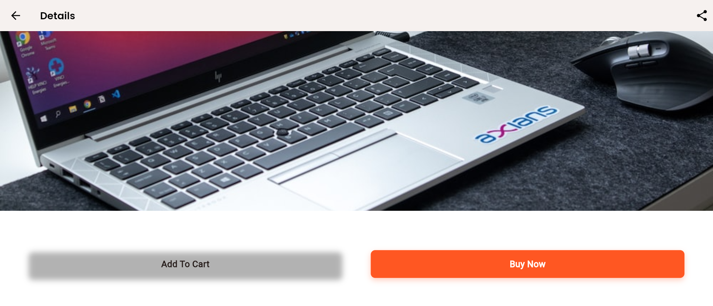</td>
  </tr>
  <tr>
    <td align="center"><b>My Orders</b></td>
    <td align="center"><b>Shipping Address</b></td>
    <td align="center"><b>Product Detail</b></td>
  </tr>
</table>

